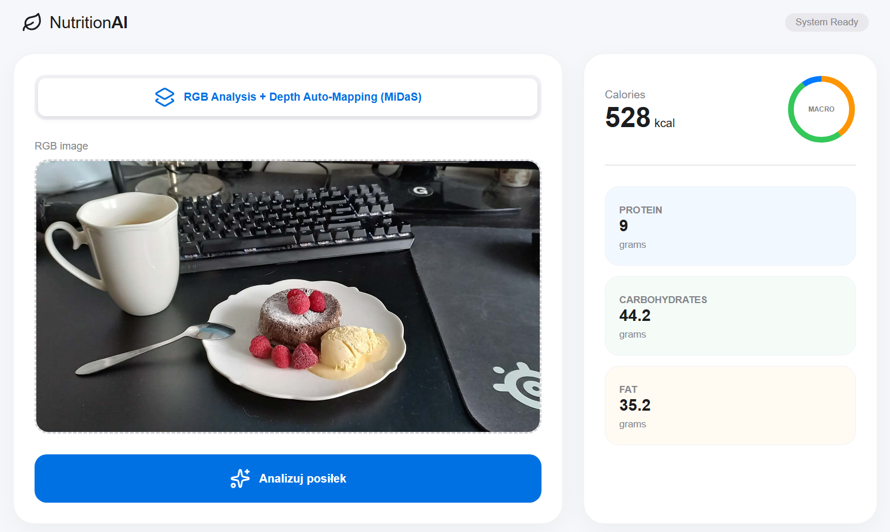

# NutriVision AI: Multimodal Food Analysis & Calorie Estimation System
**Author:** Przemysław Rządkowski  
**Topic:** Real-time estimation of macronutrients and mass from a single food image.

---

## 1. Project Description & Architectural Philosophy
This project is built on the conviction that visual data carries hidden physical properties such as volume, density, and mass that traditional classification models typically ignore. The core philosophy of this architecture is **Multimodal Semantic Fusion**: an approach assuming that combining 2D texture (RGB) with 2.5D geometry (Depth Maps) leads to a significantly deeper understanding of physical objects than either method alone.

### 1.1. Detection & Segmentation: YOLOv8 as an Intelligent Signal Filter
**Why is YOLOv8-seg the first link in the chain?** In visual food analysis, the biggest challenge is "background noise" cutlery, keyboards, or patterned tablecloths. If the entire image were fed directly into the mass estimation network, the model might erroneously assign weight to non-edible objects.

* **Smart Cropping:** Using YOLOv8 allows for precise localization of the dish and performs an **intelligent crop** with a 10% safety margin.
* **Signal Separation:** As a result, subsequent networks in the pipeline (EfficientNet and Fusion) receive "clean" data. This drastically reduces the Mean Squared Error (MSE), as the model does not waste computational power learning to ignore the background.


### 1.2. The Third Dimension Problem: MiDaS & Monokularowa Estymacja Głębi
**Why isn't an RGB photo enough?** Classic 2D photography "flattens" reality. A model seeing only RGB pixels cannot distinguish a thin slice of cake from a thick one if their top-down view is similar. This is a classic problem of missing volume information.

* **2.5D Generation:** Implementing the **MiDaS (Small)** model allows for the reconstruction of a relative depth map from a single image.
* **Volumetric Analysis:** The depth map provides information about the "convexity" and geometric structure of the meal. This allows the network to "see" whether the food is flat or spherical, which is crucial for accurate mass estimation without using specialized LiDAR sensors.


### 1.3. The Heart of the System: Multimodal Fusion Network (`FoodMassFusion`)
This project moves away from simple regressors in favor of a **dual-stream neural network** (Late Fusion) that integrates visual features with geometric ones.

* **RGB Stream (Texture & Density):** Based on the EfficientNet-V2 architecture, it analyzes the appearance of the dish. This allows the model to "understand" caloric density (e.g., fatty sauce vs. water).
* **Depth Stream (Geometry & Volume):** Processes data from the MiDaS model, extracting spatial and volumetric features.
* **Late Fusion (Feature Integration):** Instead of a `Flatten()` layer, which would destroy spatial correlation, features from both streams are concatenated and reduced to a vector using **Global Average Pooling (GAP)**.
* **Log-Space Regression:** The final layer utilizes the `torch.expm1()` function. Since food mass is never negative and often grows exponentially relative to visual size, this approach ensures a much more stable training process and higher precision for small portions.


### 1.4. Data Synthesis: Dynamic Nutritional Mapping
The final stage combines the predicted mass with product classification.

* **Database Processing:** The `app.py` script parses the `nutrition.csv` database in real-time, calculating average macronutrient values per 1 gram for each of the 101 Food-101 classes.
* **Mathematical Stability:** Automated data cleaning (removing NaNs, filtering zero-mass entries) ensures that the final kcal/macro result is mathematically consistent with the AI model's predictions.

---

## 2. Technical Documentation

### System Architecture
* **Classification Model:** EfficientNet-V2-S (backbone) pre-trained on ImageNet, fine-tuned for 101 Food-101 classes.
* **Regression Model (Mass Estimator):** Custom `FoodMassFusion` network, a dual-stream model integrating RGB and Depth data.
* **Segmentation:** YOLOv8-segmentation acting as a dynamic **ROI (Region of Interest)** extractor.
* **Input Shape:** `(480, 480, 3)` – normalized input images with aspect ratio maintenance via padding.

### Metrics & Evaluation
Standard classification matrices were replaced with regression-specific indicators:

* **Log-Scale MSE:** Minimizing error in logarithmic space allows for equally precise estimation of light snacks (e.g., raspberries) and heavy meals.
* **MAE (Mean Absolute Error):** The average difference in grams between the model's prediction and the actual weight.

**Empirical Verification:**



* **Observation:** The model correctly interpreted the volume of the dessert despite distracting objects (keyboard, spoon) thanks to the YOLOv8 filter.

---

## 3. API REST & Web Interface
The project uses the **FastAPI** framework as a high-performance bridge between Deep Learning models and the UI:

* **Endpoint:** `POST /analyze`
* **Body:** `rgb_image` (UploadFile), `model_type` (String).
* **Functionality:** 1. Receives image and converts to OpenCV format.
    2. Runs asynchronous pipeline (YOLO -> MiDaS -> Fusion).
    3. Synthesizes data with `nutrition.csv`.
    4. Returns full macronutrient profile and mass in JSON format.

---

## 4. Setup & Installation

### Download Model Weights:
Due to file size limits, the trained models are hosted on Google Drive.
1. Download `.pth` files from: [Google Drive - Food Models](https://drive.google.com/drive/folders/13_U9h6eJpttGgvX7e2SSPRIQ1iq9Kn4X?usp=sharing)
2. Place them in: `src/training/models/`

### Installation:
Recommended Python 3.11+.
```bash
python -m venv .venv
```
### Windows:
```bash
source .venv/Scripts/activate
```
### Linux/Mac:
```bash
source .venv/bin/activate
```
### Requirements:
```bash
pip install -r requirements.txt
```

---

## 5. Running the Application
Navigate to the API directory and start the Uvicorn server:
```bash
cd src/api
```
```bash
uvicorn app:app --reload
```
The application will be available at: http://127.0.0.1:8000
